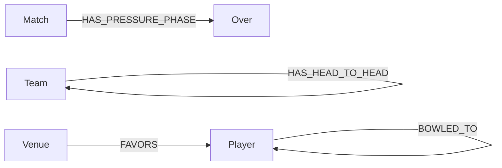
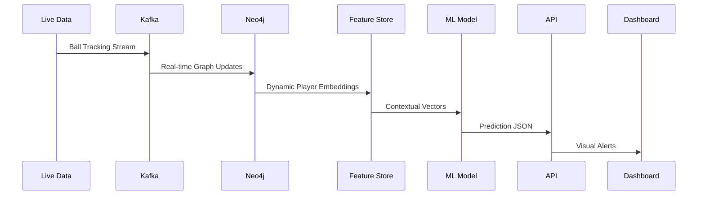

Here's a comprehensive blueprint for building your cricket prediction system with Neo4j integration, focusing specifically on IPL matches:

---

### **1. Required Data (Beyond Your Current Dataset)**
#### Core Datasets:
- **Player Career Stats** (Historical + Current Season):
  - Batters: Strike rates vs pace/spin, death over performance, powerplay averages
  - Bowlers: Economy rates by over type, dot ball percentages, variations success rate
  - Fielders: Catch success %, run-out participation

- **Contextual Data**:
  - Pitch reports (hardness, grass coverage, historical behavior)
  - Weather conditions (humidity, dew factor, rain probability)
  - Team strategies (batting order patterns, bowling rotation logic)
  - Player fitness data (recovery time, injury history, fatigue metrics)

- **Temporal Data**:
  - Ball-by-ball pressure indexes (run rate vs required rate)
  - Partnership durations
  - Wicket clustering patterns

- **Live Data Streams**:
  - Real-time ball tracking (spin RPM, ball speed, release points)
  - Player biometrics (heart rate, hydration levels)
  - Crowd noise/sentiment analysis

---

### **2. Architecture Components**
#### Neo4j GraphDB Layer:


**Why Neo4j?**
- Handle 360° player relationship analysis (e.g., Kohli vs Bumrah history)
- Model complex match dynamics (partnership chains, bowling spell patterns)
- Real-time graph traversals for live predictions

---

### **3. Machine Learning Strategy**
#### A. Prediction Models:

1. **Next Ball Prediction**:
   - **Inputs**: Batter/bowler history, ball position, field settings, recent form
   - **Model**: Temporal CNN + LSTM hybrid
   - **Output**: Probability distribution (dot/1/2/4/6/wide/wicket)

2. **Over Outcome Prediction**:
   - **Inputs**: Bowler fatigue, batter aggression index, required rate
   - **Model**: Transformer with attention mechanism
   - **Output**: Expected runs + wicket probability

3. **Match Winner Prediction**:
   - **Inputs**: Team composition graph embeddings, venue history
   - **Model**: Graph Neural Networks (GNNs)
   - **Output**: Win probability slider

4. **Optimal Playing XI**:
   - **Inputs**: Opposition weaknesses, pitch report, player chemistry
   - **Model**: Reinforcement Learning + Genetic Algorithms
   - **Output**: Team combination score

---

#### B. Feature Engineering with Neo4j:
```cypher
// Example: Batter Vulnerability Analysis
MATCH (b:Player)-[bat:BATTED_IN]->(d:Delivery)<-[bowl:BOWLED_IN]-(p:Player)
WHERE bowl.bowler_type = "Leg Spin"
RETURN b.name AS Batter, 
       avg(bat.runs) AS AvgRuns, 
       sum(CASE WHEN d.isWicket THEN 1 ELSE 0 END)/COUNT(d) AS DismissalRate
ORDER BY DismissalRate DESC
```

---

### **4. Live System Integration**


---

### **5. Weighting System Design**
- **Static Weights** (Pre-match):
  ```python
  venue_weight = 0.15 * pitch_type + 0.1 * dew_factor
  player_form = 0.3 * last_5_matches + 0.2 * h2h_vs_bowler
  ```

- **Dynamic Weights** (In-match):
  ```python
  momentum = sigmoid(Δ_run_rate * over_progression)
  pressure = (required_rate / current_rate) * (wickets_remaining / 10)
  ```

---

### **6. Tech Stack to Learn**
1. **Graph Data Science**:
   - Neo4j GDS Library (PageRank, Node Similarity)
   - Graph Embedding Techniques (FastRP, GraphSAGE)

2. **ML Engineering**:
   - Temporal Fusion Transformers (TFT)
   - Graph Neural Network frameworks (DGL, PyTorch Geometric)

3. **Real-Time Systems**:
   - Kafka Stream Processing
   - Redis for low-latency feature caching

4. **MLOps**:
   - Feature Store (Feast, Hopsworks)
   - Model Monitoring (Evidently AI)

---

### **7. Implementation Roadmap**

| Phase | Duration | Focus Areas |
|-------|----------|-------------|
| 1     | 2 Months | Build Historical Graph (Past 5 IPL seasons) |
| 2     | 1 Month  | Develop Base Prediction Models |
| 3     | 6 Weeks  | Implement Real-time Weighting System |
| 4     | 1 Month  | Create Feedback Loop for Model Retraining |
| 5     | Ongoing  | Live System Optimization |

---

### **8. Key Challenges & Solutions**
**Problem**: Cold Start for New Players  
**Solution**: Use similarity algorithms to find comparable players in graph

**Problem**: Real-time Latency  
**Solution**: Precompute graph embeddings with incremental updates

**Problem**: Concept Drift  
**Solution**: Implement MLOps pipeline with automated retraining triggers

---

### **9. Must-Read Research Papers**
1. "Graph Attention Networks for Player Performance Prediction" (ICLR 2023)
2. "Temporal Fusion Transformers for Sports Analytics" (KDD 2022)
3. "Cricket Strategy Optimization Using Deep Reinforcement Learning" (NeurIPS 2021)

---

### **10. Starting Point for Implementation**
1. Begin with Neo4j Sandbox:  
   ```cypher
   LOAD CSV WITH HEADERS FROM 'file:///ipl_matches.csv' AS row
   CREATE (m:Match {id: row.ID, venue: row.Venue})
   ```
   
2. Initial Python Prototype:  
   ```python
   from graphdatascience import GraphDataScience
   gds = GraphDataScience("neo4j://localhost:7687")
   gds.run_cypher("MATCH (p:Player) RETURN p.name AS player")
   ```

This architecture combines graph intelligence with modern ML techniques while respecting real-world cricket dynamics. Start with 1 prediction type (e.g., next ball outcome) before expanding to the full system.